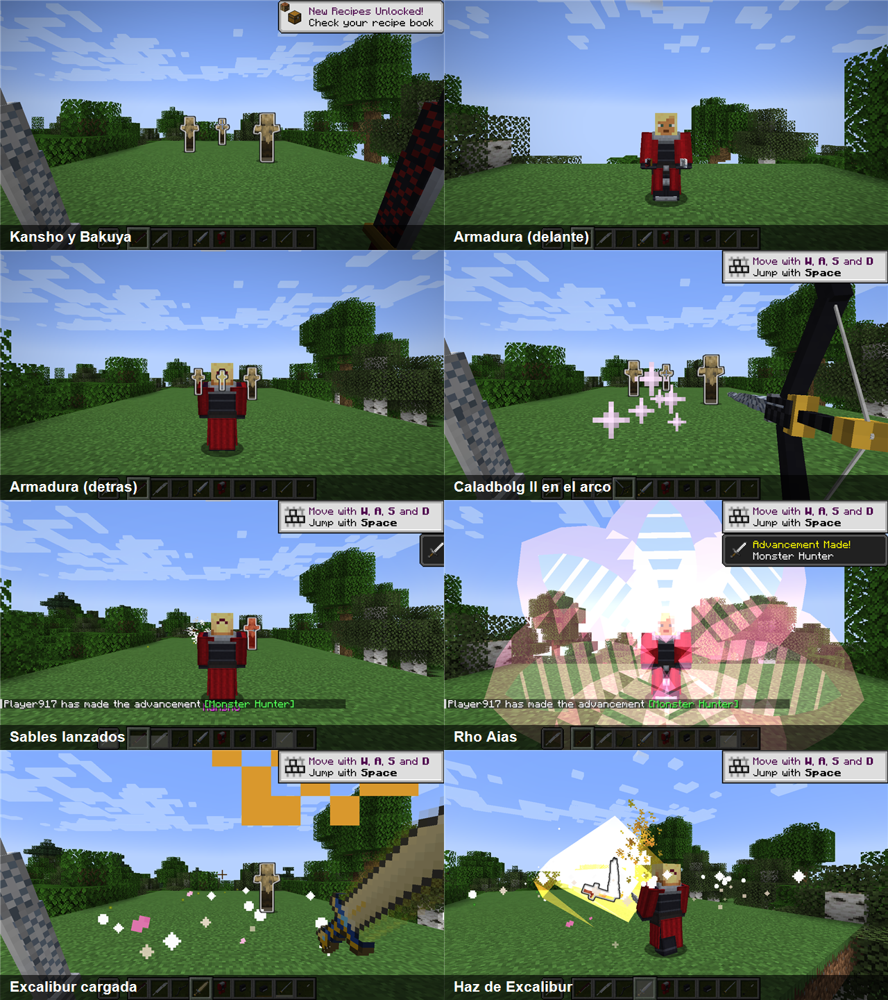
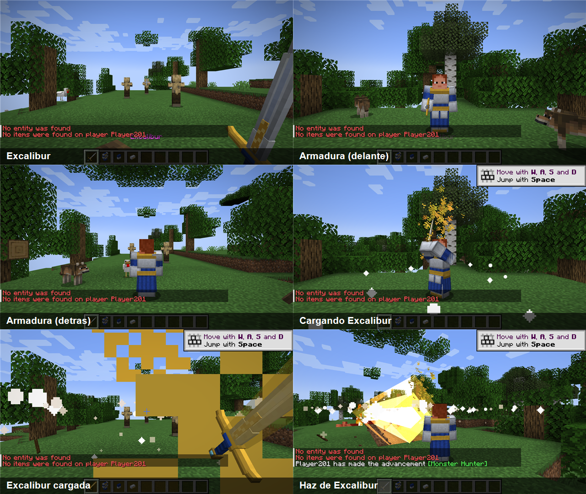
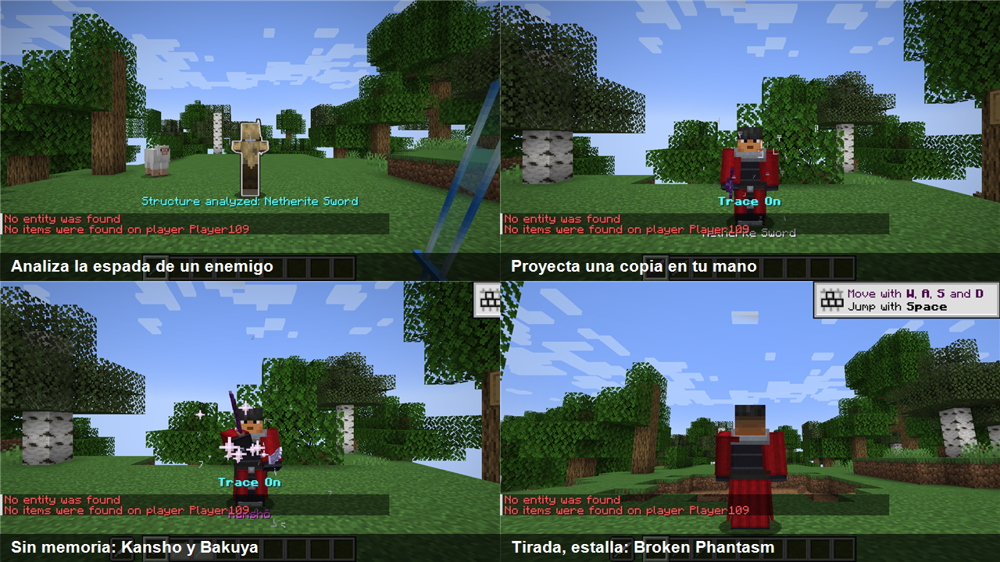
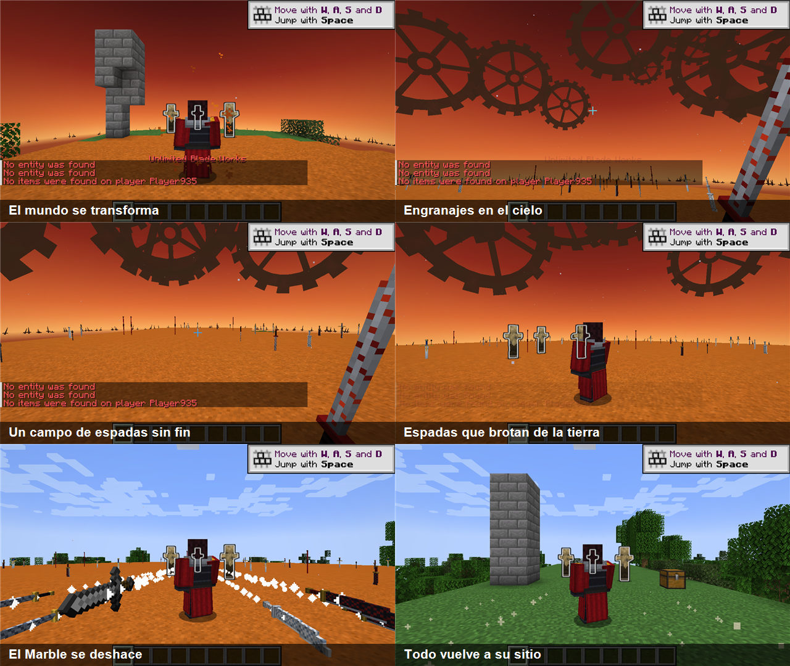
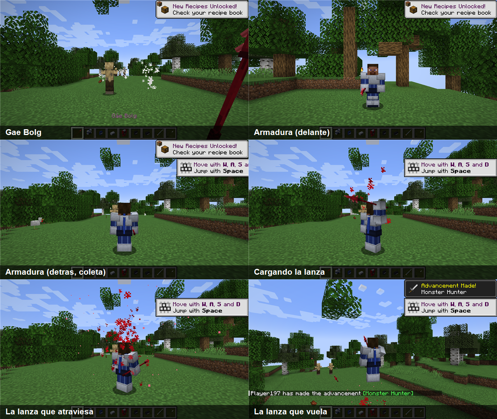
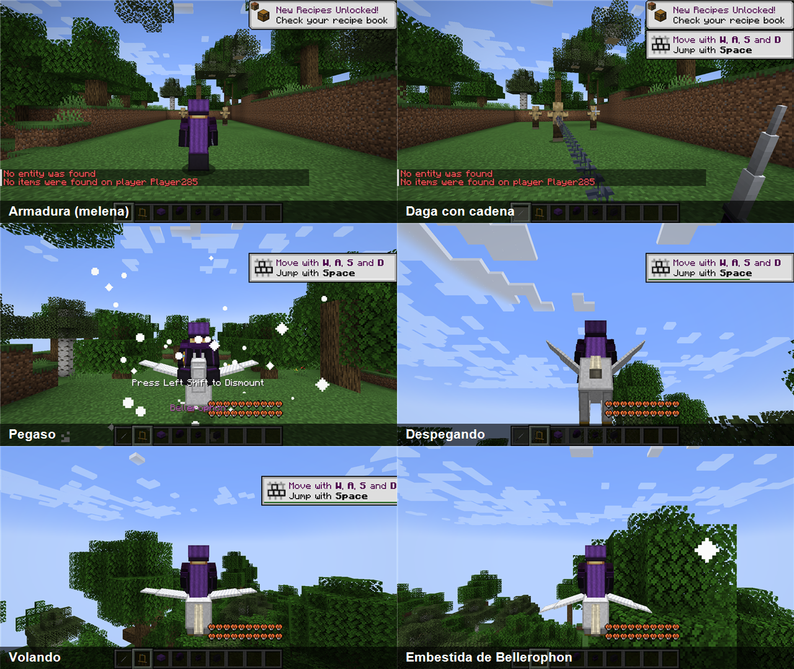
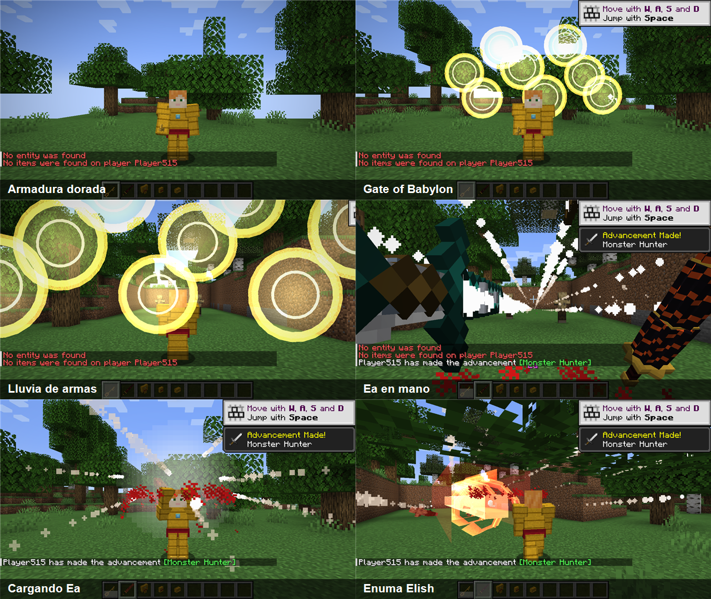
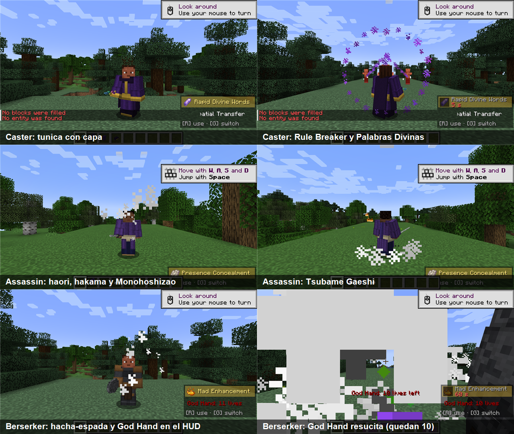
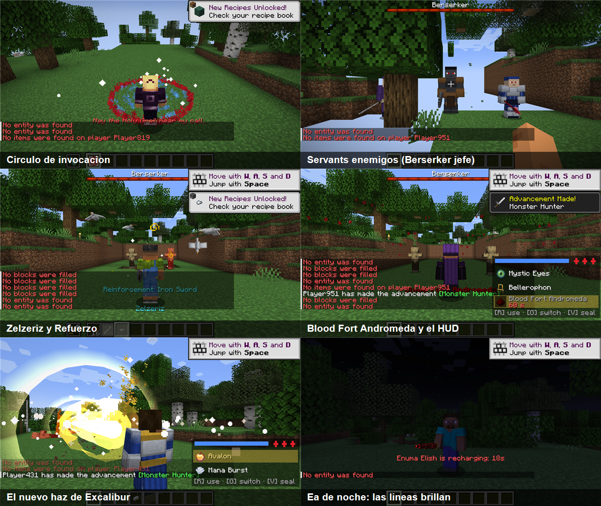

# Fate: Unlimited Blade Works

Mod de Fabric para Minecraft 1.21.1 con los servants de Fate/stay night UBW: armas, armaduras y Noble Phantasms.



## Habilidades del conjunto

Las habilidades que no son de un arma salen de la ropa: con el conjunto completo de un servant puesto aparecen en la
esquina superior izquierda. **R** usa la seleccionada y **G** pasa a la siguiente (se cambian en Opciones → Controles →
Fate: Unlimited Blade Works). Cada habilidad muestra su recarga, y cada habilidad de un arma tiene la suya propia: usar
una no bloquea a las demás.

**Maná**: la barra azul del HUD. Los Noble Phantasm y las habilidades gastan maná además de su recarga (Excalibur y
Enuma Elish 50, Unlimited Blade Works 60, las pequeñas 10-20) y se rellena solo en unos 50 s. En creativo no se gasta.

**Sellos de Comando**: los tres rombos rojos. **V** gasta uno: todas las recargas a cero, el maná lleno y 30 s de
Fuerza II, Velocidad II, Resistencia y Regeneración II. Se recupera uno cada día de Minecraft (20 min).

## Contenido

**Saber (Artoria)**
- **Excalibur** (modelo de GeckoLib): mantén click derecho 3 s y suelta para lanzar el haz de luz (48 bloques, ignora
  armadura). Al soltar, una columna de luz sube de la espada al cielo; luego sale un torrente redondo con ondas, anillos y
  estelas de luz, rayos que estallan en la espada y en la punta, una onda que barre el suelo y una cadena de destellos que
  recorre el haz (y el suelo ardiendo con `fateAbilitiesBreakBlocks`). Mientras cargas, la hoja se vuelve dorada, brilla en la oscuridad con un halo que
  late, y la alzas con las dos manos. Agachado + click derecho: **Strike Air**, ráfaga de viento en cono.
  **Invisible Air**: un remolino de viento la oculta; al cargar el Noble Phantasm o liberar Strike Air el viento se
  abre y se deshace, y al terminar vuelve a envolverla. En el inventario se ve siempre la espada.
- **Armadura** (coraza, faldar, escarpes) con modelo 3D de GeckoLib y falda animada.
  Conjunto completo: Regeneración I y **Resistencia Mágica** (inmune al daño mágico y al Wither).
  Habilidades: **Avalon** (5 s invulnerable) y **Mana Burst** (embestida que arrolla a quien esté en medio).



**Archer (EMIYA)**
- **Kanshō y Bakuya**: sables chinos anchos con caparazón de tortuga, negro y rojo uno y blanco el otro, con un punto del color de la pareja en la guarda (yin y yang). Click derecho los lanza y vuelven a la mano. Con uno en cada mano salen los dos y se cruzan.
  Agachado + click derecho: **Rho Aias**, escudo de siete pétalos que destruye proyectiles.
- **Arco de Archer**: dispara espadas proyectadas sin gastar flechas. Agachado y tensado a tope: **Caladbolg II**,
  que explota al impactar (Broken Phantasm).
- **Armadura** (peto, grebas, botas) con modelo 3D de GeckoLib y faldón animado.
  Conjunto completo: visión nocturna y los monstruos cercanos brillan. Habilidades:
  - **Trace On**: agachado analiza el arma de quien miras (o la de tu mano) y la guarda en tu memoria; normal, proyecta
    una copia (encantamientos incluidos) en un hueco libre de la barra. Sin nada analizado proyecta a Kanshō y Bakuya.
    Las proyecciones se desvanecen al minuto y no se pueden meter en cofres ni usar para craftear. Si tiras una (Q),
    sale volando y estalla al chocar: **Broken Phantasm**.
  - **Unlimited Blade Works** (Reality Marble): recitas el aria 3 s y el mundo a tu alrededor se convierte en Unlimited
    Blade Works: una cúpula de 30 bloques de radio con un páramo rojizo, espadas clavadas (las del mod y las vanilla, de madera a netherita, y tridentes) y un cielo de atardecer con
    engranajes gigantes que tapa el mundo de fuera, así que parece no tener fin. Quien esté dentro queda atrapado contigo.
    Dentro eres más fuerte (Fuerza II, Resistencia, Velocidad, Regeneración), sobre los demás llueven espadas sin parar
    y la habilidad lanza ráfagas de 16 espadas; agachado lo deshace. No se pueden romper ni poner bloques dentro.
    A los 60 s el Marble se deshace y cada bloque vuelve a como estaba, cofres y su contenido incluidos. Si el servidor
    se cae durante el Marble, los bloques se restauran al arrancar.
  - **Hrunting**: el perro de caza rojo (sus partes rojas brillan en la oscuridad), una espada-flecha que persigue a quien miras, estalla al alcanzarlo y vuelve a
    lanzarse contra él hasta tres veces.





**Lancer (Cú Chulainn)**
- **Gáe Bolg**: lanza carmesí con runas y filo que brillan en la oscuridad, y más alcance. Mantén 1 s y suelta: **la lanza que atraviesa con la muerte**,
  embiste al objetivo que miras (12 bloques) y le atraviesa el corazón sin fallar (ignora armadura, deja Wither).
  Agachado, mantén 2 s y suelta: **la lanza que vuela con la muerte**, saltas y la lanzas; persigue al objetivo
  y estalla en un área de 6 bloques.
- **Armadura** (coraza, grebas, botas) con modelo 3D de GeckoLib y coleta animada.
  Conjunto completo: Velocidad I, **Protección contra Proyectiles** (el 75% no te hiere) y
  **Continuación de Batalla** (sobrevives a un golpe mortal, cada 5 minutos). Habilidad: **Runa Ansuz**, tres bolas
  de fuego en abanico.



**Rider (Medusa)**
- **Daga de Rider** con cadena: click derecho la lanza; si engancha a un enemigo lo hiere y lo atrae, si se clava en un
  bloque te impulsa hacia él.
- **Armadura** de 4 piezas: Breaker Gorgon (venda), vestido con melena animada, medias y botas.
  Conjunto completo: Velocidad I y Salto II. Habilidades:
  - **Ojos Místicos**: quien te mira de frente queda casi petrificado (lentitud extrema, fatiga y debilidad).
  - **Bellerophon**: invoca a **Pegaso** (modelo 3D animado) y lo montas. Mira hacia arriba y avanza para despegar;
    vuela hacia donde miras. Montado, la habilidad lanza **la embestida de Bellerophon**, un cometa de luz que arrolla
    todo a su paso. Pegaso desaparece si se queda sin jinete.
  - **Blood Fort Andromeda**: un templo de sangre de 10 bloques que durante 10 s absorbe la vida de los demás y te cura.



**Gilgamesh**
- **Ea** (modelo de GeckoLib): sus tres cilindros giran de verdad, más deprisa al cargar, y sus líneas rojas brillan en
  la oscuridad. Mantén click derecho y suelta para **Enuma Elish**, un vórtice en espiral de 64 bloques que arrastra hacia su eje
  lo que pasa cerca y desgarra lo que toca (ignora armadura). Al soltar, un torbellino rojo arranca trozos del suelo; luego
  el vórtice sale con seis cintas en espiral, rayos rojos que restallan, ondas que lo recorren y explosiones de la base a
  la punta. Quien esté cerca de cualquiera de los dos ve un destello de su color y nota la sacudida.
- **Armadura dorada** (coraza, grebas, escarpes) con escarcelas animadas. Conjunto completo: **Regla de Oro**
  (Suerte II y Resistencia I). Habilidades:
  - **Gate of Babylon**: ocho portales dorados detrás de ti que disparan una lluvia de armas del tesoro hacia lo que miras.
  - **Enkidu**: las Cadenas del Cielo atan a quien miras (32 bloques) y no le dejan moverse durante 5 s.



**Caster (Medea)**
- **Rule Breaker**: daga en zigzag de colores que brillan en la oscuridad. Click derecho a quien tienes delante: la puñalada que rompe todo contrato
  mágico. Le quita todos los efectos, rompe la doma (el animal pasa a ser tuyo), disipa a Pegaso y deshace su Reality
  Marble.
- **Túnica** (capucha, túnica, faldones, botas): capucha y capa verde oscuro con ribete y adorno dorados sobre la
  túnica morada, y la capa se mueve. La capucha es opcional. Conjunto completo: Regeneración I y sin daño por caída.
  Habilidades: **Palabras Divinas Rápidas** (rayos de maná a los seis enemigos más cercanos frente a ti) y
  **Transferencia Espacial** (apareces donde miras, hasta 32 bloques).

**Assassin (Sasaki Kojirō)**
- **Monohoshizao**: nodachi larguísima con más alcance. Mantén 1 s y suelta: **Tsubame Gaeshi**, tres cortes en el mismo
  instante que no se pueden esquivar.
- **Haori y hakama** con faldones y coleta animados. Conjunto completo: Velocidad I y **Ojo de la Mente** (esquiva uno de
  cada cuatro golpes cuerpo a cuerpo). Habilidad: **Ocultación de Presencia** (invisible 10 s; los monstruos te pierden).

**Berserker (Heracles)**
- **Hacha-espada**: una losa de piedra con mango. Mantén 1,5 s y suelta: **Nine Lives**, nueve golpes en un instante a todo
  lo que tengas delante.
- **Brazales, taparrabos y grebas** con faldones animados. Conjunto completo: **God Hand**, once vidas de más (resucitas
  con la vida llena y recuperas una cada 2 minutos; el HUD muestra cuántas te quedan) y los golpes de menos de 4 de daño
  no te hacen nada. Habilidad: **Locura Mejorada** (Fuerza III, Velocidad II y Resistencia durante 15 s).

**Archer (Ishtar)**
- **Maanna**: la Barca del Cielo como arco dorado con una gema azul. Dispara flechas de luz sin gastar flechas; tensado
  del todo, una joya que estalla. Agachado y cargando 3 s: **An Gal Ta Kigal Shè**, Venus disparada como un haz dorado
  que estalla donde choca.
- **Ropa** como en su primera ascensión: top blanco con ribetes dorados y collar de oro con gema negra, braguita negra
  con cinturón dorado, guante negro largo en el brazo izquierdo y brazalete en el derecho, media negra con liga en forma
  de corona y espinillera en la pierna derecha y tobillera en la izquierda (lo que va al aire deja ver tu skin). La
  **tiara** (opcional) es su corona dorada con picos. Con el conjunto puesto, **Maanna flota a tu lado**: una barca en
  media luna azul y dorada que se mece a tu derecha. Con la mano principal vacía, mantén click derecho para tensarla:
  se pone delante de ti apuntando adonde miras y dispara igual que el arco en la mano (flechas de luz, joyas y, agachado,
  An Gal Ta Kigal Shè). Conjunto completo: Velocidad I y sin daño por caída. Habilidades: **Ráfaga de Joyas** (cinco
  joyas en abanico que estallan), **Manifestación de la Belleza** (los que tienes cerca quedan débiles y lentos y dejan
  de atacarte) y **Barca del Cielo** (Maanna te lanza hacia donde miras y planeas 5 s; se puede usar dos veces seguidas, con 4 s para el segundo salto, antes de la recarga).



**Servants enemigos**
- **Berserker** (jefe, con barra de vida): 40 de vida y God Hand con once vidas más (480 en total), ignora golpes débiles y usa Nine Lives.
  Solo aparece con su huevo; suelta su hacha-espada.
- **Lancer**: rápido, esquiva casi todos los proyectiles y se lanza con la Gáe Bolg.
- **Assassin**: invisible hasta que te tiene cerca, esquiva golpes y usa Tsubame Gaeshi.
- Lancer y Assassin aparecen de noche muy de vez en cuando (`fateServantSpawns` lo quita) y a veces sueltan su arma
  o una pieza de ropa.

**Guerra del Santo Grial**
- **Círculo de invocación**: click derecho en el suelo con un catalizador en la otra mano. Tras un ritual de 3 s aparece
  el equipo completo del servant: manzana dorada → Saber, tinte rojo → Archer, fragmento de prismarina → Lancer, ojo de
  ender → Rider, bloque de oro → Gilgamesh, amatista → Caster, pluma → Assassin, cuero → Berserker, diamante → Ishtar (sin catalizador,
  uno al azar).
- **`/grailwar start`** (operadores): a cada jugador conectado le toca un servant distinto, con su equipo, el maná lleno
  y tres Sellos de Comando. Quien muere queda de espectador; el último en pie gana el **Santo Grial**.
  `/grailwar status` dice quién sigue y `/grailwar stop` la termina. Desconectarse cuenta como rendirse, pero la
  guerra se guarda con el mundo: si el servidor se reinicia o se cae, sigue donde estaba.
- **Santo Grial**: click derecho abre "¿Qué deseas?" con los nueve servants. Eliges uno y el Grial te concede su poder:
  su equipo completo (puesto), además de vida y maná al máximo y los tres Sellos de Comando. Se gasta al pedir el deseo.

**Objetos de los Masters**
- **Joya de Tohsaka** (Rin): se lanza y libera su maná en una explosión.
- **Póster reforzado** (Shirou): pega como una espada de hierro; click derecho, Refuerzo: repara una cuarta parte de lo
  que llevas en la otra mano y te da Fuerza I.
- **Zelzeriz** (Illya): tres pájaros de alambre de plata vuelan a tu alrededor 15 s y atacan a los monstruos cercanos.



Todo está en la pestaña **Fate: Unlimited Blade Works** del creativo, y tiene recetas de crafteo.

**Choque de Noble Phantasms**: si los haces de dos jugadores (Excalibur, Enuma Elish, An Gal Ta Kigal Shè) se
encuentran, los dos se frenan en el punto de choque y empujan durante unos 0,7 s entre destellos. Gana el que tenga
más maná en ese momento: el otro estalla y el ganador sigue hasta su largo completo.

**Plano de cámara**: al soltar la carga de Excalibur, Enuma Elish, An Gal Ta Kigal Shè, Caladbolg II o la Gáe Bolg
arrojada, tu personaje mantiene la postura un segundo (el arma en alto o el arco tenso) y entonces sale el ataque. La
cámara pasa a tercera persona y se coloca detrás de ti a la derecha, en diagonal y algo más alta, como vista desde
arriba, para ver cómo lo lanzas y el ataque entero. Al lanzarlo la imagen tiembla y el campo de visión da un golpe; el
plano gira despacio mientras dura, con bandas de cine arriba y abajo, y a los 3,5 s vuelve a tu vista.

## Encantamientos

Cada uno va solo en su arma. Los normales (I-III) salen en la mesa de encantamientos; los **legendarios** no: se
encuentran en cofres y los venden los aldeanos bibliotecarios (más caros). Con un libro se ponen en el yunque.

| Arma | Encantamiento | Efecto |
|---|---|---|
| Excalibur | **Radiant Blade** (I-III) | Cargando más de 1 s y soltando antes de Excalibur, el tajo deja llamas delante 3 s; el nivel sube el radio y el daño. |
| Excalibur | **Avalon's Grace** (legendario) | Mientras cargas, regeneración; al soltar (tras 1 s de carga) te curas 2 corazones. |
| Kanshō y Bakuya | **Yin-Yang Resonance** (I-III) | Al golpear con uno, 15/30/45 % de que la pareja de la otra mano golpee justo después. |
| Kanshō y Bakuya | **Trace Resilience** (legendario) | Llevándolos encima, las proyecciones de Trace On duran el triple (3 min). |
| Arco de Archer | **Broken Blade** (I-III) | Las espadas disparadas tienen 15/30/45 % de dar Marchitamiento (más largo con el nivel). No afecta a no-muertos. |
| Arco de Archer | **Phantasm Bloom** (legendario) | La explosión de Caladbolg II es un 50 % más grande, sin gastar más maná. |
| Gáe Bolg | **Cursed Thrust** (I-III) | La estocada a fondo hace +20 % de daño por nivel (ignora la armadura, como toda la Gáe Bolg). |
| Gáe Bolg | **Bloodied Spear** (legendario) | Quien muere a tus manos deja un círculo de sangre 6 s que da Marchitamiento y Lentitud a quien lo pisa. |
| Daga de Rider | **Chain Whip** (I-III) | El enganchado por la cadena queda débil y lento (más tiempo con el nivel). |
| Daga de Rider | **Gorgon's Grip** (legendario) | Con la daga en la mano, Ojos Místicos remata a los petrificados (el doble si están malheridos). |
| Ea | **World Severance** (legendario) | Enuma Elish es un 40 % más ancho y, con `fateAbilitiesBreakBlocks`, los bloques que arranca salen volando como escombros. |
| Rule Breaker | **Contract Breaker** (legendario) | Al apuñalar a alguien con mejoras, le quitas la más fuerte y la recibes tú un segundo después. |
| Monohoshizao | **Heartbeat** (legendario) | 5 % de acertar en el corazón: los monstruos normales mueren de golpe; jefes, servants y jugadores reciben 25 de daño. |
| Hacha-espada de Berserker | **God Hand** (legendario, I-III) | Al bajar del 30 % de vida, Resistencia III y Absorción durante 4/6/8 s (una vez por minuto). |

## Animaciones del cuerpo

Con [Player Animator](https://modrinth.com/mod/playeranimator) (va incluido en el jar), los demás jugadores y tú en
tercera persona veis cómo se mueve todo el cuerpo:

- **Excalibur**: alzas la espada a dos manos mientras cargas, con las piernas abiertas, y al soltar descargas el
  golpe de arriba abajo.
- **Ea**: la levantas con una mano hacia el cielo, la otra abierta a un lado, y al soltar Enuma Elish la bajas
  apuntando al frente.
- **Gáe Bolg**: estocada a fondo al atravesar; al lanzarla (agachado), la echas atrás por encima de la cabeza y la arrojas.
- **Rule Breaker**: puñalada de arriba abajo.
- **Rho Aias**: la mano abierta al frente sosteniendo el escudo.
- **Maanna y el arco de Archer**: con An Gal Ta Kigal Shè o Caladbolg II mantienes el arco tenso un segundo y, al
  soltar, la mano de la cuerda sale hacia atrás y el cuerpo recibe el retroceso.
- **Monohoshizao**: guardia baja con el cuerpo girado mientras concentras, y los tres cortes de Tsubame Gaeshi.
- **Kanshō y Bakuya**: el brazo que lanza (o los dos, si lanzas la pareja) con giro del torso.

Las animaciones están en `src/main/resources/assets/fate_ubw/player_animations/` y se pueden editar con Blockbench.

Con [Better Combat](https://modrinth.com/mod/better-combat) instalado (opcional), los golpes normales de las armas
usan sus animaciones: Excalibur y Ea como espada, Gáe Bolg como lanza, Kanshō y Bakuya como alfanjes, la Monohoshizao
como katana, Rule Breaker y la daga de Rider como dagas y el hacha-espada de Berserker como hacha a dos manos
(`data/fate_ubw/weapon_attributes/`).

## Líneas de voz

Excalibur, Avalon, Gáe Bolg, Enuma Elish, Gate of Babylon, Unlimited Blade Works (y su aria), Trace On, Caladbolg,
Rho Aias, Bellerophon, Rule Breaker, Tsubame Gaeshi, Nine Lives y An Gal Ta Kigal Shè dicen su nombre al usarse. Se apagan con
`/gamerule fateVoiceLines false`.

## Gamerules

| Gamerule | Por defecto | Qué hace |
|---|---|---|
| `fateAbilitiesBreakBlocks` | `false` | Excalibur y Enuma Elish abren un túnel, Caladbolg II y la Gáe Bolg lanzada explotan como TNT (nunca dentro de un Reality Marble; bedrock y obsidiana no se rompen) |
| `fateCooldownPercent` | `100` | Porcentaje de todas las recargas (50 = la mitad, 0 = sin recargas) |
| `fatePlayerDamagePercent` | `100` | Porcentaje del daño de las armas y habilidades del mod contra otros jugadores |
| `fateMana` | `true` | Las habilidades gastan maná |
| `fateVoiceLines` | `true` | Los Noble Phantasm dicen su nombre |
| `fateServantSpawns` | `true` | Lancer y Assassin enemigos aparecen de noche |

Con el PvP del servidor desactivado (`pvp=false`), las habilidades tampoco atraen, petrifican, encadenan ni empujan a
otros jugadores (antes solo se evitaba el daño).

## Instalar

En la carpeta `mods` de una instancia **Fabric 1.21.1** (Fabric Loader 0.16 o superior):

1. `fate_ubw-<versión>.jar` (de la pestaña **Releases** de este repo)
2. [Fabric API](https://modrinth.com/mod/fabric-api) para 1.21.1
3. [GeckoLib](https://modrinth.com/mod/geckolib) 4.7.x para Fabric 1.21.1

## Compilar

Necesita JDK 21.

```
gradlew build
```

El jar sale en `build/libs/`.

## Herramientas de desarrollo

- `java tools/ServantAssets.java src/main/resources/assets/fate_ubw`: regenera los modelos 3D de los servants
  (ítems JSON, geo de GeckoLib) y sus texturas, con las partes que brillan (_glowmask). Cada armadura sale también
  como proyecto de Blockbench (`geo/item/armor/<servant>_armor.geo.bbmodel`) con la textura dentro, listo para
  retocar a mano. Si una armadura se ha retocado (su geo, textura o `.bbmodel` ya no coincide con lo que escribió el
  generador, ver `tools/generated-hashes.txt`), el generador la deja como está.
- `gradlew runShowcase`: abre un cliente de desarrollo que crea un mundo, usa cada arma y habilidad,
  guarda capturas en `run-showcase/screenshots` y se cierra solo. No entra en el jar publicado.
  Con la variable de entorno `FATE_SHOWCASE=saber` (o `archer`, `lancer`, `rider`, `gilgamesh`, `ubw`, `trace`, `hud`,
  `caster`, `assassin`, `berserker`, `ishtar`, `falchions`, `enchants`, `clash`, `npfx`, `carve`, `maanna`, `avalon`, `poses`, `glow`, `armors`, `grailwar`, o varios separados por
  comas) solo prueba esas secciones. `FATE_WORLD=<carpeta de run-showcase/saves>` reabre un mundo de una ejecución
  anterior en vez de crear uno (para probar lo que se guarda, como la Guerra del Santo Grial).

---

Mod de fans sin ánimo de lucro. Fate/stay night y sus personajes pertenecen a TYPE-MOON.
